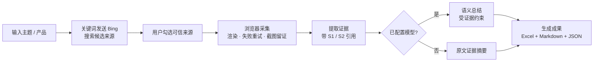

<div align="center">


# DeskResearch

**输入研究主题，自动搜索公开网页、核对证据，生成带引用的 Excel 底稿、Markdown 报告与 JSON 证据。**

<p>
  
  
  
  
  
</p>

</div>

---

一个**本地优先的 macOS 办公调研 Agent**：输入研究主题或需要比较的产品，它会搜索公开网页、让你勾选可信来源、提取带 `[S1]` / `[S2]` 引用的证据原文，并生成 **Excel 证据底稿 + Markdown 报告 + JSON 证据**。可配置 OpenAI 兼容模型接口，生成受证据约束的语义总结。

> 💡 **本地安全执行** —— 只访问你勾选的公开页面，不读浏览历史与登录态，不提交表单；成果只保存在本地。

## 🧭 工作流程



## ✨ 功能特性

| 能力 | 说明 |
| --- | --- |
| 🔍 主题搜索 | 精简关键词后发送 Bing，查找公开候选来源 |
| ✅ 来源确认 | 用户勾选可信页面，只访问被授权的 URL |
| 📑 证据引用 | 提取带 `[S1]` / `[S2]` 引用的网页原文，保留 URL、原文片段与失败状态 |
| ⚠️ 冲突提示 | 跨来源词面冲突提示，供人工复核（不代替事实裁决） |
| 🧠 模型总结 | 可选配置 OpenAI 兼容接口；只把已抽取证据交给模型，无证据编号的结论会被丢弃 |
| 📊 成果生成 | Excel 证据底稿、Markdown 报告、JSON 证据，均可本地打开 |
| 🔐 本地安全 | 不读浏览历史 / 登录态 / Cookie，不提交表单，API Key 加密存储 |

## 🧱 技术栈

| 层 | 技术 |
| --- | --- |
| 🖥️ 桌面端 | Electron 44 · macOS（Apple Silicon） |
| 🌐 浏览器采集 | Playwright（Chrome / Edge / Chromium） |
| 📊 成果生成 | ExcelJS（.xlsx）· Markdown · JSON |
| 🤖 模型 | OpenAI Chat Completions 兼容接口（可选） |
| 🗄️ 存储 | 本地任务目录 `~/Documents/DeskResearch/outputs/` |

## 📁 目录结构

```text
desktop/          Electron 主进程、预加载脚本与界面
src/              浏览器采集、证据分析、成果生成
  src/lib/        采集器、证据、模型合成等核心模块
config/           官方来源配置（sources.json）
build/            应用图标
scripts/          发布打包与签名校验脚本
data/             运行数据（已 gitignore）
outputs/          本地测试产物（已 gitignore）
```

## 🚀 下载安装

可从 GitHub Release 下载预构建安装包：

```text
https://github.com/MN0709/DeskResearch/releases/latest
```

解压后，将 `DeskResearch.app` 拖入「应用程序」。

要求：

- Apple Silicon Mac
- macOS 13 或更高版本
- 已安装 Google Chrome、Microsoft Edge 或 Chromium

任务成果保存在：

```text
~/Documents/DeskResearch/outputs/
```

> 当前 `v0.1.0` Release 使用临时本地签名、尚未公证，首次打开时 macOS 可能要求在 Finder 中右键应用并选择「打开」。正式签名与公证见下文「签名与公证」。

## 💻 本地开发

需要 Node.js 20 或更高版本。

```bash
npm install
npm run desktop
```

点击左下角「设置」按钮可填写 `Base URL`、模型名与 `API Key`。API Key 经 Electron `safeStorage` 加密后保存在应用数据目录，macOS 下密钥由系统钥匙串保护；界面只能获知“是否已配置”，不能读回密钥。

运行浏览器采集与产物测试：

```bash
npm run poc
```

## ⚙️ 模型配置

在应用左下角「设置」中配置 OpenAI Chat Completions 格式接口：

| 项 | 说明 |
| --- | --- |
| Base URL | 模型接口地址（OpenAI / DeepSeek / Kimi 等兼容接口均可） |
| 模型名 | 模型 ID |
| API Key | 密钥，经系统钥匙串加密保存，不写入项目与成果文件 |

配置后，Agent 会把已抽取的证据交给模型生成语义总结；未配置模型时，自动回退为原文证据摘要。

## 🛡️ 安全边界

- 搜索候选公开页面，只访问用户在来源确认窗口中勾选的 URL。
- 不读取浏览历史、现有登录状态或 Cookie。
- 不自动提交表单、购买或发送消息。
- 不控制 Pages、Numbers、Excel、Word 等原生应用。
- 文件只保存在本地任务目录。
- API Key 不写入项目、成果文件或渲染页面，仅在任务运行时传给本地子进程。

## 🧰 常用命令

| 命令 | 用途 |
| --- | --- |
| `npm run desktop` | 启动桌面应用 |
| `npm run desktop:smoke` | 检查桌面安全桥接和关键界面 |
| `npm run poc` | 验证采集、引用校验并生成成果 |
| `npm run package:mac` | 构建并 ad-hoc 临时签名 `.app`（本机运行） |
| `npm run package:mac:signed` | 构建并用 Developer ID 签名、公证 |
| `npm run release:zip` | 生成 ad-hoc 签名的发布 ZIP |
| `npm run release:zip:signed` | 生成已签名并公证的发布 ZIP |
| `npm run verify:mac` | 校验签名身份、公证票据与 Gatekeeper |

## ✍️ 签名与公证（进阶）

本地构建默认使用 ad-hoc 临时签名，仅用于本机运行。正式公开分发需要 Apple Developer ID 签名并通过公证，这样其他用户打开时不会触发 Gatekeeper 的「未验证开发者」提示。

前提条件：

1. Apple Developer Program 账号，并在钥匙串中安装「Developer ID Application」证书。
2. 在 [appleid.apple.com](https://appleid.apple.com) 生成 App 专用密码。
3. 已知 Team ID。

```bash
export APPLE_ID="你的 Apple ID 邮箱"
export APPLE_APP_SPECIFIC_PASSWORD="xxxx-xxxx-xxxx-xxxx"
export APPLE_TEAM_ID="你的 Team ID"

npm run release:zip:signed
npm run verify:mac
```

生成物：

```text
release/mac-arm64/DeskResearch.app
release/DeskResearch-0.1.0-mac-arm64.zip
```

## 📌 当前状态

版本 `0.1.0` 已在 Apple Silicon Mac 上完成安装版验证：4 个产品、9 个官方页面、失败来源 0。代码已发布到 GitHub，`v0.1.0` Release 附带当前 ad-hoc 签名的安装包。
